```{r setup, include=FALSE}
library("rstan")
rstan_options(auto_write = TRUE)
options(mc.cores = parallel::detectCores())
```
\newpage

\section{Statistical Mechanics}

This section is a short introduction to statistical mechanics summarizing [source].

The first core assumption of statistical mechanics is that the system of interest exists in one of a discrete set of microstates. The number of microstates can be countably infinite. In fact, the number of microstates is often assumed to be dense enough to be arbitrarily close to any given state. A collection of microstates, often with some defining property, is a macrostate. For example, the collection of microstates with energy 2 is a macrostate. Let Omega(E) be the size of the macrostate (also called the density of states) with energy E.

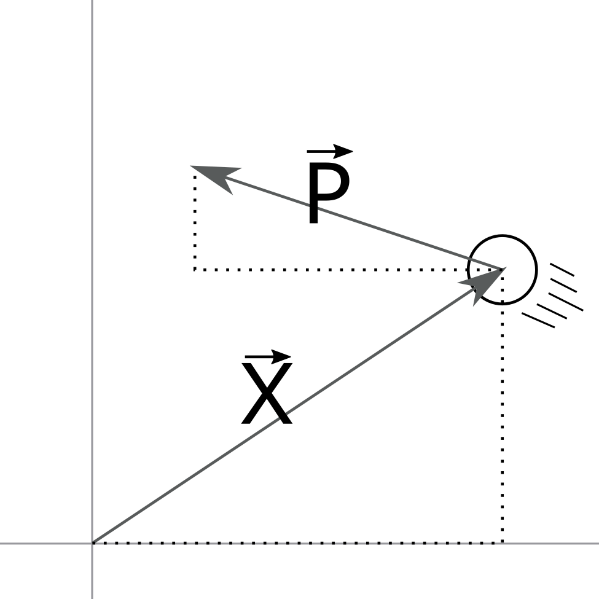{width=3.25in}

In an example system consisting of a single particle on a plane, there are 4 coordinates: 2 positional coordinates and 2 momentum coordinates. The position does not affect energy, which is given by E=|p|^2/2m. Every microstate with energy E must have |p| prop E^0.5; the momentum coordinates must lie in a circle. The size of the macrostate is proportional to the radius of the circle or omega prop E^0.5. In higher dimensional space, either corresponding to having more spatial dimensions or to having more particles, this proportionality takes the form omega prop E^(D-1)/2. Due to the exponential nature of this inequality, the logarithm of the density of states is often used. 

\subsection{Canonical Distribution}

Much of the complexity and usefulness of statistical mechanics appears when systems are not entirely isolated. If we take an isolated system with some energy E_T and split it into two systems then E_T=E_a+E_b+E_ab. If the two portions are sufficiently independent (often by having B be significantly larger than A) then this can be approximated E_T=E_a+E_b. While the total energy E_T is conserved, E_a can vary to any value! This collection of two systems which share energy and only energy is called a canonical ensemble. For reasons which can be well justified, but are outside the scope of this paper, we approximate the density of states of B as log omega = alpha + beta E_b. If the density of states of B is independent of A then the density of states omega_a(E_a)=omega_b(E_b). Combining these various assumptions together, we find p(E_a) prop omega_A (E_A) prop e^-beta E_a. Beta is defined to be 1/kT. For our purposes, we will use units where k=1, so beta=1/T.

Stan uses prior probabilities and likelihood functions in its simulation of the posterior. Our uninformative prior is the uniform distribution. We must still specify a likelihood function which captures the physical model we wish to sample. In a canonical ensemble the log probability of any state is $-\beta E + c$ where $E$ is the energy of the state and $c$ is an arbitrary constant. We define the likelihood as $p(\beta | E) \sim e^{-\beta E}$ and sample states with various $E$.

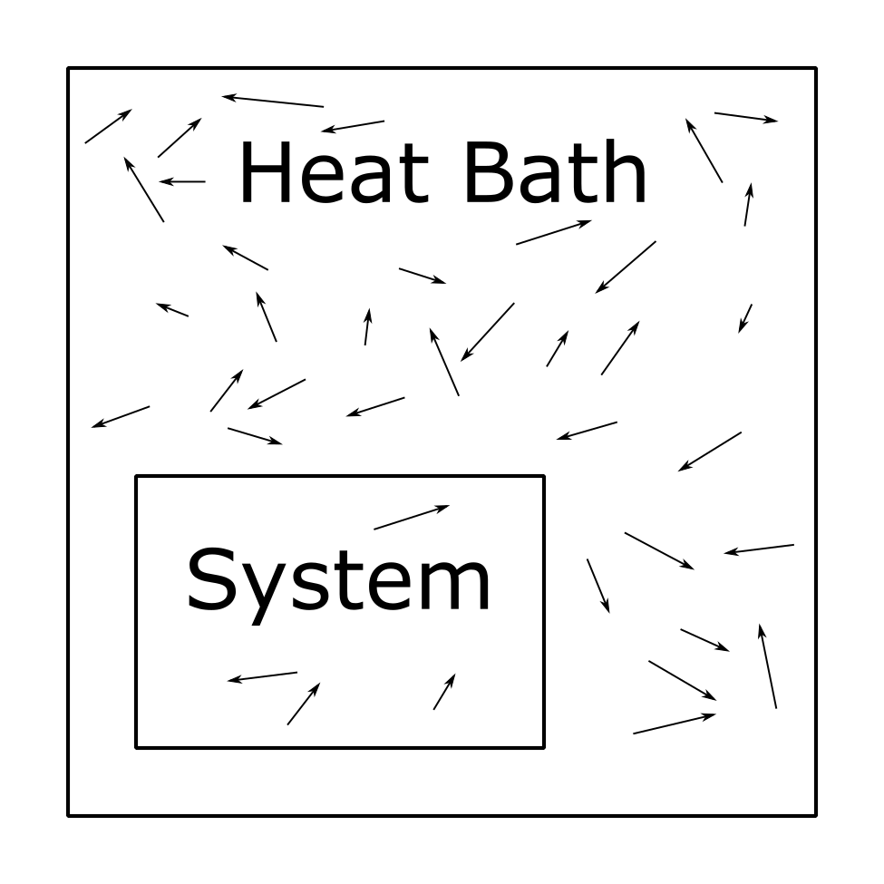{width=3.25in}

In a one dimensional single particle space, E = p^2/2m. By substituting into the previous equation we get prob(p) prop E ^ -beta * p^2/2m. It is simply an unnormalized normal distribution with mean 0 and variance ___. Generally speaking, energy divided by temperature is the negative log likelihood to within a constant. Later we describe how we utilized this correspondence to sample from a statistical mechanical model from within the Bayesian sampling oriented framework of Stan.

```{stan output.var="temp",eval=FALSE}
functions {
  real xy_energy(vector[,] spins) {

    real energy = 0;
    int spin_dim[4] = dims(spins);

    for (dir in 1:2) {

      //calculate the offset for nearest neighbor calculations
      int dir_x = dir % 2 + spin_dim[1];
      int dir_y = dir / 2 + spin_dim[2];

      for (x in 1:spin_dim[1]) {
        for (y in 1:spin_dim[2]) {
          //calculate the x,y index of the nearest neighbor
          int x_idx = ( (x + dir_x - 1) % spin_dim[1] ) + 1;
          int y_idx = ( (y + dir_y - 1) % spin_dim[2] ) + 1;

          energy += dot_product( spins[x_idx, y_idx], spins[x, y] );
        }
      }
    }

    return energy;
  }

  //given the temperature and energy, calculate the likelihood
  real canonical_ensemble_lpdf(real temperature, real energy) {
    return energy / temperature;
  }
}
```

\section{Physical Model}

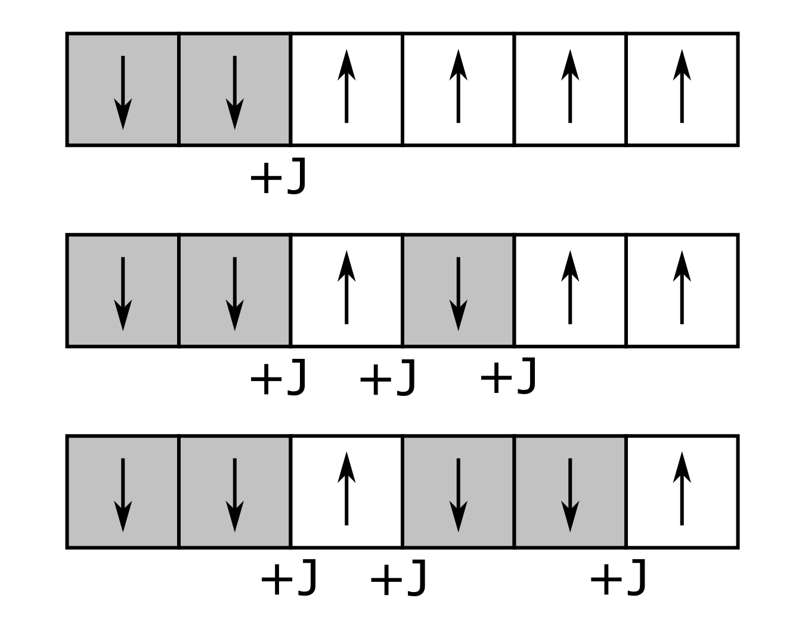{width=3.25in}


One particularly simple statistical mechanical model with profound implications on reality is the Ising Model. It consists of an N-dimensional lattice of elements which either have spin up or spin down. The total energy of the system is the sum of interactions between neighboring elements. summation -Si Sj. If the spins are in the same direction then the energy is lower. In 2 dimensions the Ising Model has two distinct phases. In the ordered phase almost all of the spins are in the same direction and the average spin is not near zero. At higher temperatures, in the unordered phase, the spins are random, and the average spin is almost exactly zero. The transition between the two phases happens suddenly as temperature increases.

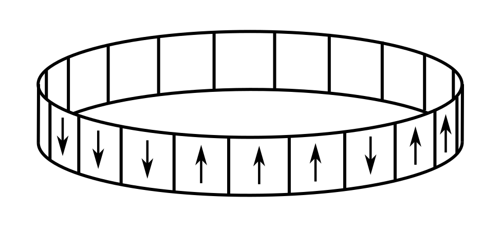{width=3.25in}


There are a variety of interesting and efficient ways of sampling from the distribution of states of the Ising Model, however due to it only being defined by discrete variables Stan is not one of them [@stan]. While small numbers of discrete parameters can be marginalized out manually, this procedure is complex for the large number of parameters in which we are interested. For this work we instead focus on the XY Model. In the XY model the spins are not up or down. Instead the spins are unit vectors in the XY plane. The energy due to the interaction of spins between two neighbors is -Si dot Sj. While the XY model does not have a phase transition of the same sort as the Ising model, it does have similar behaviours in more complex variables. The spins orient into larger scale cyclic structures called vortices. At higher temperatures there is suddenly a drastic increase in the density of vortices.

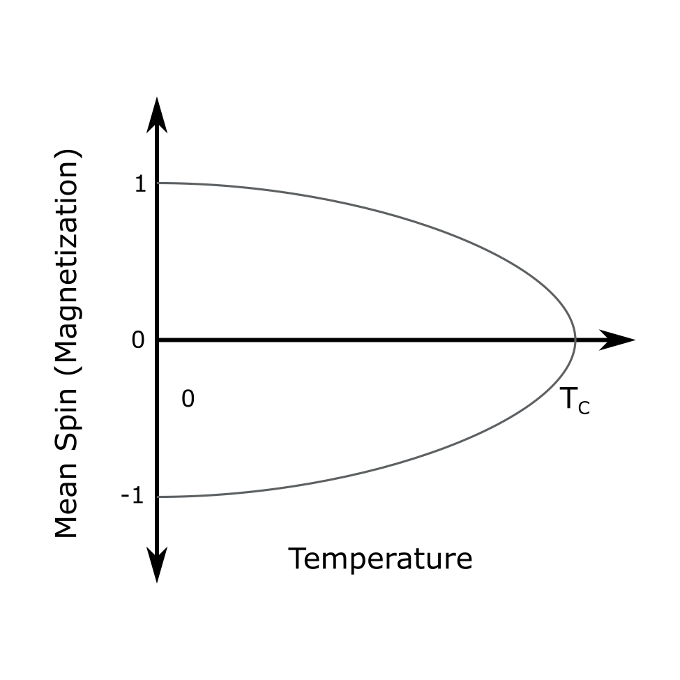{width=3.25in}

The XY Model is similar to the Ising Model, but with an extra degree of freedom for the spins. The energy of any given state is related to the dot products of the spins of nearest neighbors on the lattice. $$E=-J\sum_{<i,j>}\hat{\sigma}_i\cdot\hat{\sigma}_j$$ Each spin is a unit vector in the XY plane rather than the binary up or down seen in the Ising Model. Unsurprisingly, this change leads to a drastic shift in the dynamics. The Ising Model has a second order phase transition with changing temperature. It also has a first order phase transition with changing external magnetic field. However, the XY Model on a 2 dimensional lattice has no first or second order phase transitions. It does however exhibit a  Kosterlitz-Thouless transition. The KT transition relates to the appearance of vortices on the lattice [@Tobochnik1979]. A vortex is a swirling pattern centered on a lattice tile. At the critical temperature $T_{KT}$ vortex pairs unbind and move apart. Previous work has shown that for the XY Model on a 2D lattice, $T_{TK}\approx 0.893$ [@Jensen]. When we refer to the XY Model in the rest of this work, we will mean the 2D case.

We implement the spins as 2d vectors constrained to have unit length [@stan_user]. Essentially, our sampling parameters are a multidimensional array of unit vectors. Every iteration we calculate the energy based on nearest neighbor interactions between those spins and set the log likelihood accordingly.

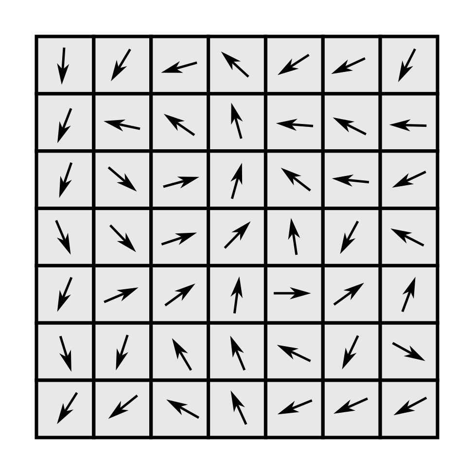{width=3.25in}

\subsection{Vorticity}

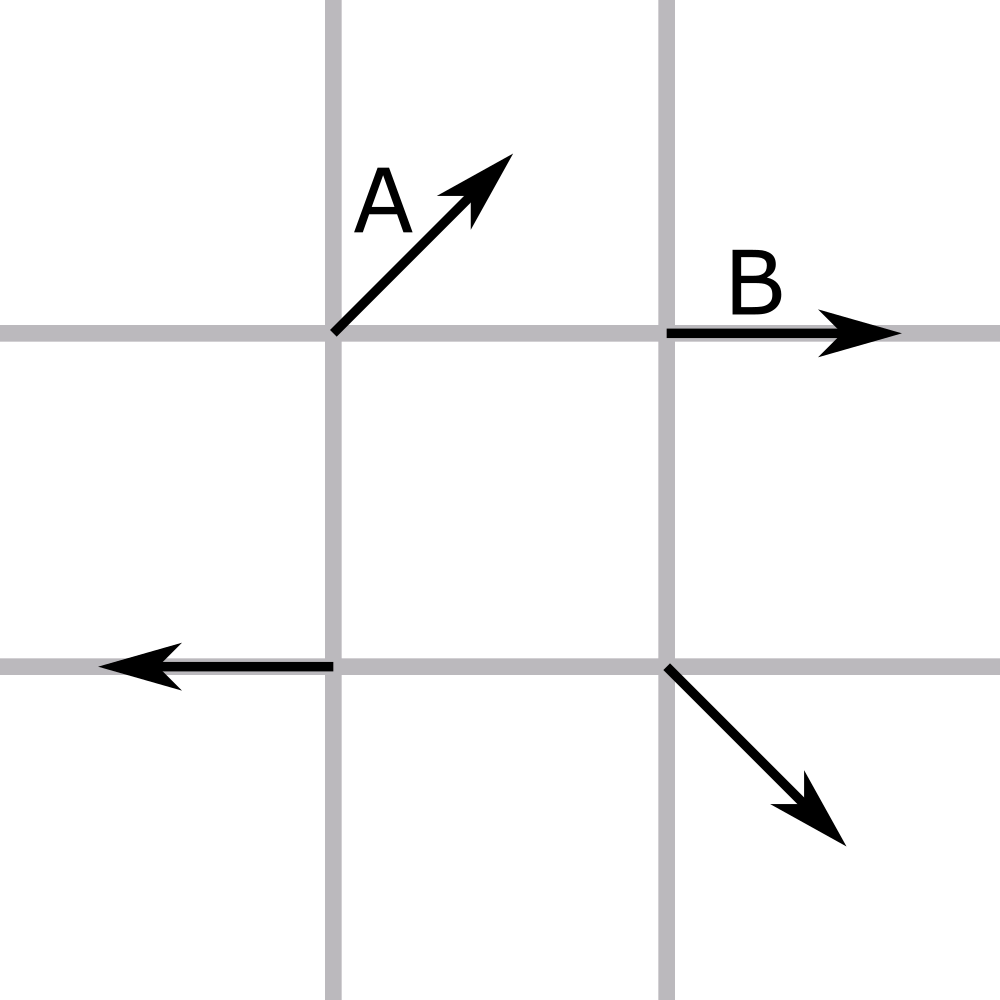{width=3in}

The KT transition arises from an appearance of large vortices. We identify vortices by looking for lattice cells where the corner spin vectors tend to point clockwise or counterclockwise. Specifically we calculate the shortest difference in angles in the counterclockwise direction and sum. In the figure above, the angle between vectors A and B would be -45 degrees. This sum can either be $2\pi$, $0$, or $-2\pi$ (technically it can also be $4\pi$ and $-4\pi$ but those cases are exceedingly unlikely). On a lattice with periodic boundary conditions, there will be the same number of vortices ($2\pi$) and anti-vortices ($-2\pi$)[@Imriska2009]. We generally calculate the density of vortices on 100 random samples from spin configurations at each temperature.

```{r}
crossvec <- function(x,y){
 cv <-  x[1]*y[2]-x[2]*y[1]
 return(invisible(cv))
}

get_coordinates <- function(x,y,dir,spin_dim) {
  dir_x <- ((0 < dir) && (dir < 3)) + spin_dim[1]
  dir_y <- (dir > 1) + spin_dim[2]
  
  x_idx <- ( (x + dir_x - 1) %% spin_dim[1] ) + 1;
  y_idx <- ( (y + dir_y - 1) %% spin_dim[2] ) + 1;

  return(c(x_idx, y_idx))
}

vorticity_calc <- function(spin_array) {
  spin_dim = dim(spin_array)[1:2]
  angles = array(0,c(4,spin_dim))
  
  for (x in 1:spin_dim[1]) {
    for (y in 1:spin_dim[2]) {
      
      for (dir in 0:3) {
        a <- get_coordinates(x,y,dir,spin_dim)
        b <- get_coordinates(x,y,(dir + 1) %% 4,spin_dim)
        
        dotted <- crossprod(
          spin_array[a[1],a[2],1:2],spin_array[b[1],b[2],1:2])
        dotted <- pmax(-1, pmin(1, dotted))
        crossed <- crossvec(
          spin_array[a[1],a[2],1:2],spin_array[b[1],b[2],1:2])
        angles[dir+1,x,y] <- acos(dotted) * sign(crossed)
      }
    }
  }
  
  around_angles <- apply(angles,c(2,3),sum)
  vortex <- sum(around_angles > 1)
  return(vortex)
}
```

While the above code is rather bulky, it has a simple purpose: to count the number of lattice squares which have a total rotation of spin vectors greater than 0. Because clockwise and counter clockwise rotations need to have opposite signs, some complexity is added in the form of cross products.

\section{Parameters and Iterations}

For most experiments we ran 5000 NUTS iterations each on 4 parallel chains with a goal rejection rate of 0.7 and a maximum tree depth of 15. The effective sample sizes were always at least a tenth of the number of iterations except on two of the tests around a temperature of 1 on the 24x24 and 32x32 experiments with $j=-1$. The aforementioned 24x24 experiment was run with 1000 NUTS iterations. All calculations were performed on an Intel Core i7 8th generation processor. The total computation time was on the order of 5 days.

We ran experiments on 4x4, 8x8, 16x16, 24x24, and 32x32 lattices. In plots N refers to the side length of the lattice: a NxN lattice. Energy refers to the energy per lattice site.

\section{Model Example}

The data for the model holds the temperature and the size of the lattice. The sampling parameters are the spins on that lattice.

```{stan output.var="temp",eval=FALSE}
data {
  real<lower=0> temp;
  int<lower=1> dim_x;
  int<lower=1> dim_y;
}
parameters {
  unit_vector[2] spin[dim_x, dim_y];
}
```

The energy is calculated as a transformed parameter based on the xy_energy function. It is then normalized by the size of the lattice to allow easier comparison of different tests. The model block indicates that we are sampling from a distribution representing a canonical ensemble at a specific temperature.

```{stan output.var="temp",eval=FALSE}
transformed parameters{
  real energy = xy_energy(spin);
  real energy_per_spin = energy / dim_x / dim_y;
}
model {
  temp ~ canonical_ensemble(energy);
}
```

We load the model from an external file, however it is identical to the Stan snippets shown.

```{r,cache=TRUE}
model = stan_model('xy_model.stan')
```

The dimension of the lattice and the temperature are stored in the input data and then the distribution is sampled.

```{r,cache=TRUE}
#basic parameters
chains <- 4
vorticity_samples <- 1000
iterations <- 10000
dim_x <- 4
dim_y <- 4
temp <- 2.

#initialize the data dictionary
data <- list(dim_x=dim_x, dim_y=dim_y, temp=temp)

#simulate the distribution
fit <- sampling(model,
      data=data,chains=chains,
      iter=iterations,
      verbose=FALSE,
      control = list(max_treedepth=15))
```

After sampling from the canonical distribution at a specific temperature, we calculate a few statistics. 

```{r}
print(summary(fit,pars="energy_per_spin")$summary)

energy = mean(extract(fit,pars='energy_per_spin')$energy_per_spin)
energy_var = var(extract(fit,pars='energy_per_spin')$energy_per_spin)
specific_heat = var(extract(fit,pars='energy')$energy) / dim_x / dim_y / temp / temp

spin_data <- extract(fit,pars="spin")$spin

vorticity <- mean(apply(spin_data[1:vorticity_samples,,,],1,vorticity_calc))
vortex_density <- vorticity / dim_x / dim_y
sprintf("Energy: %f Specific Heat: %f Vortex Density: %f",
        energy,specific_heat,vortex_density)
```

While we calculate specific heat using the variance of the energy, its simplest interpretation is the amount of energy which must be added to the system to raise the temperature by 1 degree. The units of temperature are not actually a familiar scale, but this is not relevant for the vast majority of the analysis.

\section{Results}

\subsection{KT Phase Transition}

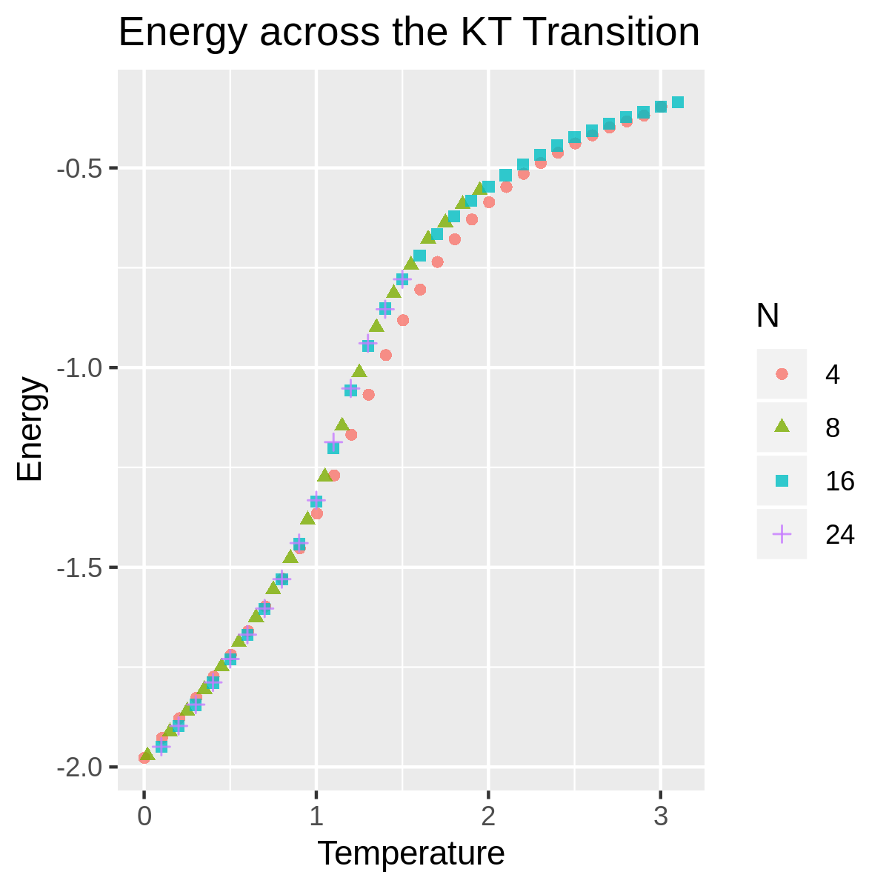{width=3.25in}

The important details of the previous figure are that it is non-linear and that once the lattice size reached 8x8, the temperature-energy curve appears to have converged. While there is no verticle asymptote indicating a phase transition, there is a region with drastically steeper slope. Additionally after the KT Transition, this steep region, energy increases fairly linearly with temperature.


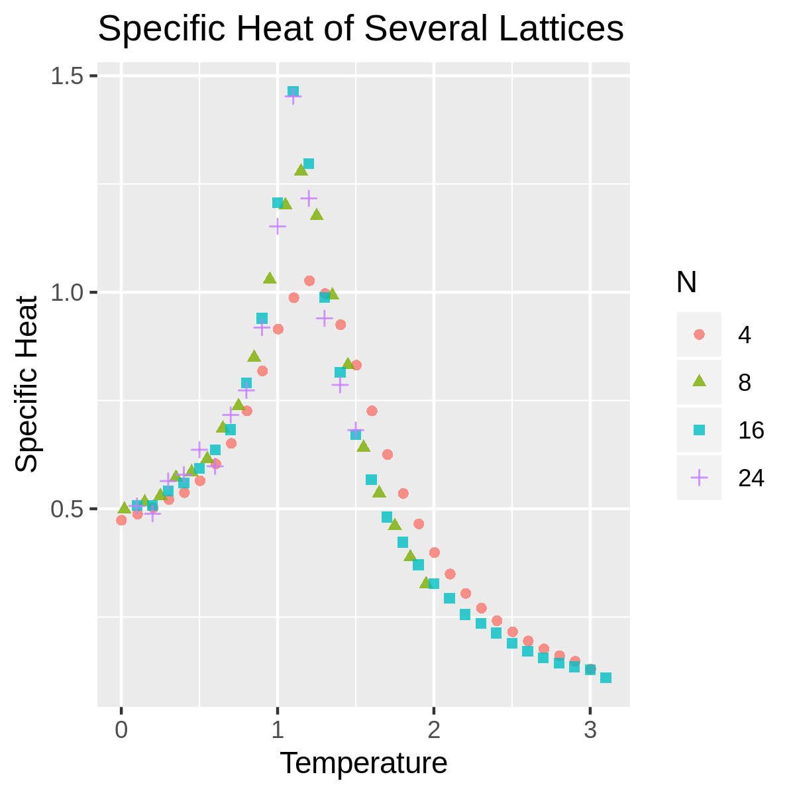{width=3in}

The specific heat starts around $c=0.5$ at a temperature of 0. The peak specific heat occurs around a temperature of 1.1. Looking at the specific heat plot makes phase transition behaviours more obvious. At certain types of phase transition the specific heat of the system approaches infinite as the system size grows. The XY model (and the KT transition) appears to be a bit more finite and the largest system sizes we tested converged.


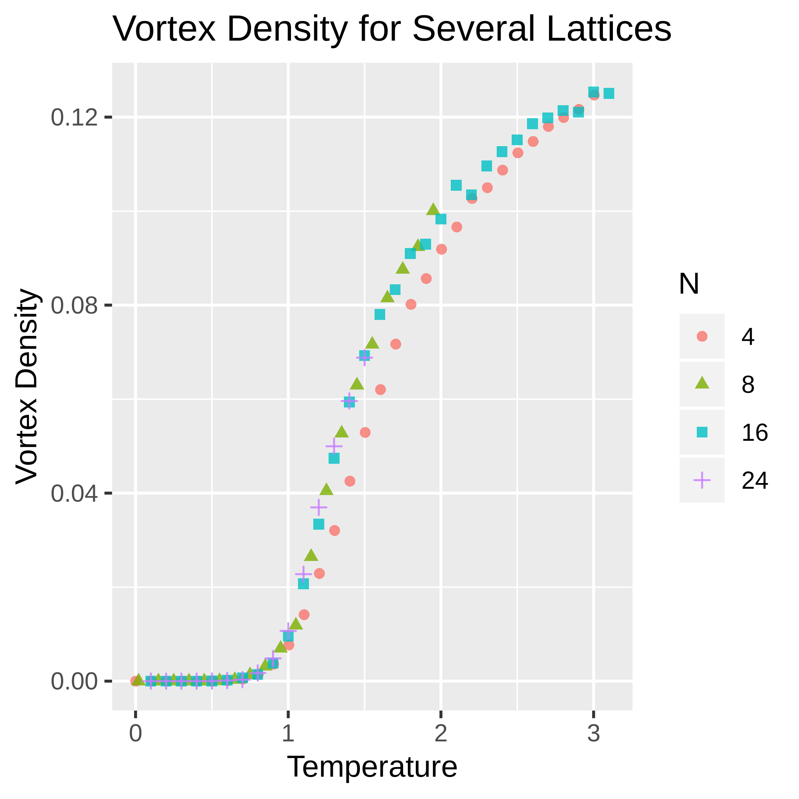{width=3in}

The vortex density of the XY model exhibits some similar characteristics to the magnetism of the Ising model. Both have a region where they are almost exactly 0 followed by a jump towards larger values. Unlike the Ising model, this jump in the XY model is smooth. At all system sizes we tested there is a soft transition between regions. As a side note there are oddly enough not any particularly noticeable changes in the vortex density around the peak specific heat.

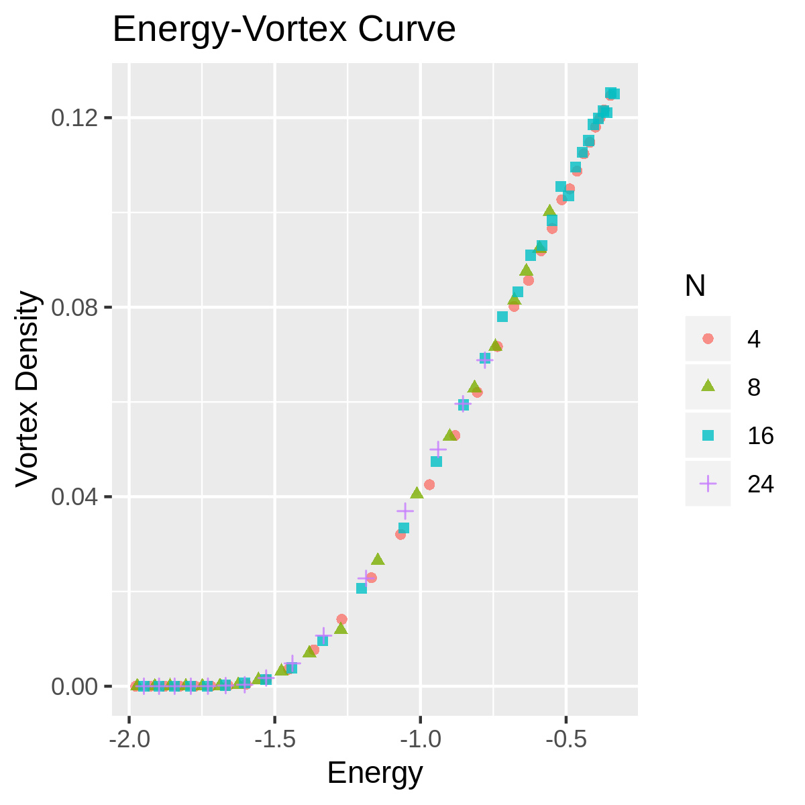{width=3.25in}

After some cutoff, increasing the amount of energy leads to an almost linear increase in the number of vortices. Above energy densities of -1.5 per lattice point, 1 unit of energy density increase is equivalent to a vortex density increase of slightly over 0.1. Equivalently, adding a single vortex to the overal system requires slightly less than 10 units of energy.

\subsection{Reversed Interactions (J=-1)}

{width=3.25in}

Many of our early experiments were run with $J=-1$. This may not have been intentional. However, we found that the energy curves of the XY Model with $J=1$ are identical to those with $J=-1$. The figure above shows the difference between the mean energy for chains on the same lattice at the same temperature for the two different values of $J$. As temperature increases the differences also increase, but the mean difference remains close to zero for all lattice sizes. The lowest energy states for $J=-1$ are the highest energy states for $J=1$. Flipping half of the spins in a checker pattern by 180 degrees transforms directly between low energy states for the two coupling coefficients.

\section{Conclusions}

The XY Model has a wealth of interesting dynamics. The energy of the system after the KT transition is directly proportional to the number of vortices on average. An interaction strength (J) of negative 1, while it does lead to different patterns of vortex pairing, does not have a significantly different energy at any temperature. The lowest energy states with $J=-1$ are the highest energy states of $J=1$; there is a strong symmetry between the two extremes of energy. Stan provided fairly sophisticated sampling methods with minimal coding effort. The built in diagnostics helped to validate the resulting chains and gauge the accuracy of their estimates. While its lack of support for discrete parameters limits the models for which it is useful, there are still a wealth of contexts in which it is a good first choice for simulating models.


