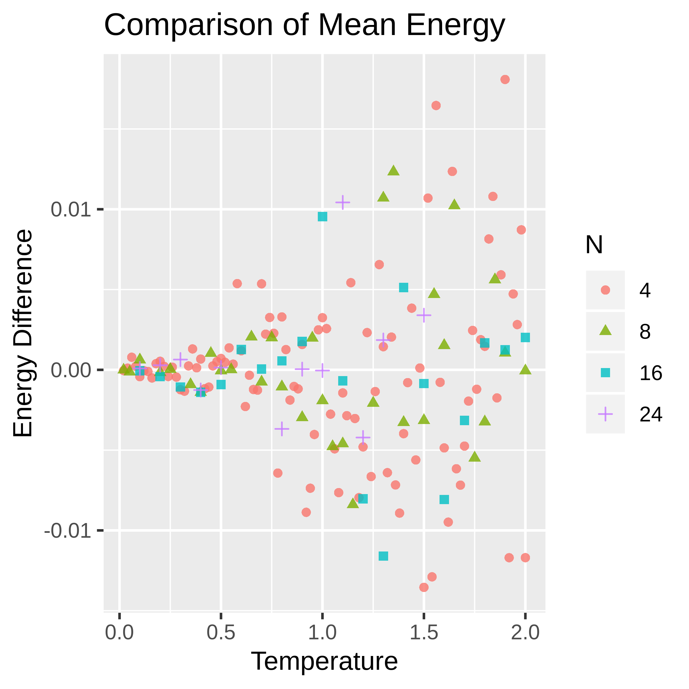

```{r setup, include=FALSE}
library("rstan")
rstan_options(auto_write = TRUE)
options(mc.cores = parallel::detectCores())
```
\newpage

# Statistical Mechanics

We begin with a short introduction to statistical mechanics summarizing a digital book by Eastman [@Eastman2015].

The core assumption of statistical mechanics is that the system of interest exists in one of a discrete set of states, called microstates. The number of microstates can be finite or countably infinite. The number of microstates is often assumed to be dense enough to be arbitrarily close to any given state. For example, a free particle can be described using a discrete location, as long as the possible locations are extremely close together. A macrostate is generally defined as the set of microstates which share some property. For example, the collection of microstates with energy 2 is a macrostate. The number of microstates in the macrostate with energy E is $\Omega(E)$. $\Omega$ is also known as the density of states, in a close analogue to probability densities. In fact, the probability density of a particular macrostate is proportional to $\Omega$. The normalizing constant is called the partition function. We ignore the partition function and use unnormalized probabilities throughout this work.

{width=3.25in}

Take the system consisting of a single free particle on a plane. There are 4 coordinates: 2 position and 2 momentum. The position does not affect energy, which is given by $E=\frac{|\vec{p}|^2}{2m}$. Therefore, every microstate with energy $E$ must have $|\vec{p}| \propto E^{1/2}$. At a given energy the momentum coordinates have a single magnitude; they must lie in a circle. The size of the macrostate is proportional to the circumference of the circle or $\Omega(E) \propto E^{1/2}$. In higher dimensional space, either corresponding to having more spatial dimensions or to having more particles, this proportionality takes the form $\Omega(E) \propto E^{(D-1)/2}$. Because this proportionality and its equivalents for other systems grow exponentially with the number of particles in the system, their logarithms are often used.

## Canonical Distribution

Much of the complexity and insightfulness of statistical mechanics appears when systems are not entirely isolated. However, a completely open system would unfortunately have a huge number of parameters and vast variability. To allow analysis of a system which is nearly open, the standard method is to take a large isolated system and break it into two interacting subsystems. If one of these subsystems is much smaller than the other, it can be viewed as an open system in a homogeneous environment. The canonical ensemble describes such a partitioning between a system of interest and a much larger heat bath. The only interactions between the subsystems are modeled as random exchanges of energy. While the energy of the system as a whole remains constant, the subsystem of interest has constant fluctuations. There are other ensembles which allow particles or volume to transfer between the partitions, but even the canonical ensemble provides fascinating dynamics.

{width=3.25in}

For reasons which can be well justified -- we will not justify them for the sake of simplicity and conciseness -- we approximate the density of states of the heat bath as $\log( \Omega_{bath}) = \alpha + \beta E_{bath}$. We also assume that the densities of states and the energies of the heat bath and the subsystem of interest are independent. Independence means that the following holds: $$\Omega_{system}\Omega_{bath}=\Omega_{total}$$ $$E_{system}+E_{bath}=E_{total}$$ There are no additional states possible due to interactions between the system and heat bath and also no additional energy. Combining these various assumptions together gives a single equation: $$p(E_{system}) \propto \Omega(E_{system}) = \Omega_{system}(E_{system})\Omega_{bath}(E_{bath}) \propto \Omega_{system}(E_{system})e^{-\beta E_{system}}$$. $\beta$ is $\frac{1}{kT}$ where T is temperature and k is the Boltzmann constant. For our purposes, we will use units where $k=1$, so $\beta=\frac{1}{T}$. This choice of units means that temperature does not correspond directly to any familiar scale; fortunately, the units of temperature are not relevant for the vast majority of the analysis. The factor of $\Omega_{system}(E_{system})$ is handled implicitly by the metropolis algorithm; this term describes the number of microstates within the subsystem of interest with a given energy. The $e^{-\beta E_{system}}$ factor relates to the relative probabilities of those microstates (although it is constant for microstates of a single energy).

As an application, consider the canonical ensemble describing a one dimensional space with a single free particle. As previously mentioned $E = \frac{p^2}{2m}$. By substitution we get $$P(E_{particle}) \propto \Omega_{particle}(E_{particle}) e ^ {-\beta E_{particle}} \propto e ^ {-\beta \frac{p^2}{2m}}$$ The number of microstates of the single free particle can be dropped from the proportionality because at any given energy it is 2: one with positive p and one with negative p. In the momentum variable, the probability distribution is simply a normal distribution with mean 0 and variance $m/\beta=mT$. While the momentum of a free particle in an isolated system is obviously not described by a normal distribution, when energy can be randomly added or removed the momentum will eventually approach normality.

We use Stan to sample from canonical ensembles using unnormalized probabilities at specific temperatures ($T=\frac1\beta$). Our uninformative prior is the uniform distribution. In a canonical ensemble the log probability of any microstate of the subsystem of interest is equal within a constant to $-\beta E$ where $E$ is the energy of the state. We define the likelihood as $$p(\beta | E) \sim e^{-\beta E}$$ At a fixed temperature we sample microstates with various energies. The following code calculates this likelihood function.

```{stan output.var="temp",eval=FALSE}
//given the temperature and energy, calculate the likelihood
real canonical_ensemble_lpdf(real temperature, real energy) {
  return -energy / temperature;
}
```

# Physical Model

{width=3.25in}

One particularly simple statistical mechanical model is the Ising Model. It consists of a K-dimensional lattice of elements which either have spin up or spin down. These elements could be thought of as atoms in a metal; if their spins are generally aligned there is a net magnetic field. The total energy of the system is the sum of interactions between nearest neighbors. 

$$E=- J\sum_{<i,j>} S_i S_j$$
$J$ is a scalar describing the strength of the interactions. The spins are described by $S_i,S_j\in\{-1,1\}$. If the spins are in the same direction (have the same sign) then the energy is lower. Two nodes on the lattice are nearest neighbors if and only if their coordinates differ by no more than 1 in a single dimension. The nodes (1,3) and (2,3) are nearest neighbors, while (1,3) and (2,4) are not. Rather than defining arbitrary rules to describe the boundaries of the lattice, it is wrapped around such that no boundaries exist. This approach to handling the edges is called a periodic boundary condition. The figure below shows the result for a 1 dimensional Ising Model. 

{width=3.25in}

The Ising Model behaves differently in different numbers of dimensions. When the dimensionality is high, it behaves like a mean field model. In 1 dimension it can be solved analytically without too much difficulty. The 2 dimensional case is far harder to analyze and also has deeper dynamics. In 2 dimensions the Ising Model has two distinct phases. In the ordered phase at low temperatures almost all of the spins are in the same direction. In the unordered phase at higher temperatures the spins are uncorrelated, and the average spin (magnetization) is almost exactly zero. The transition between the two phases occurs suddenly as temperature increases. In fact, the transition happens so suddenly that the derivative of magnetization with respect to temperature has a jump discontinuity. The derivative of the energy with respect to temperature has a similar jump; this feature is a second order phase transition [@Cross2008]. A first order phase transition would have the jump in energy and magnetization rather than in their derivatives.

{width=3.25in}

Due to the complexity of analyzing it, one of the simplest ways to garner information about the 2 dimensional Ising Model is by sampling from its probability distribution of microstates at various temperatures. There are a variety of interesting and efficient ways of sampling from this distribution. Because the model is only defined by discrete variables, Stan is unfortunately not one of them [@stan]. While small numbers of discrete parameters can be marginalized out manually, this procedure is complex for the large number of parameters in which we are interested. Due to this limitation we instead focus on the XY Model.

The XY Model is similar to the Ising Model, but with an extra degree of freedom for the spins. The energy of any given state is related to the dot products of the spins of nearest neighbors on the lattice.

$$E=-J\sum_{<i,j>}\hat{\sigma}_i\cdot\hat{\sigma}_j$$ 

Each spin $\hat{\sigma}_i\hat{\sigma}_j$ is a 2D unit vector considered to be embedded in the XY plane. If these vectors are further constrained to be on the X axis while maintaining unit length then it is fairly easy to see that the energy equation simplifies to the Ising Model.

{width=3.25in}

The 2D Ising Model has a second order phase transition with changing temperature. It also has a first order phase transition as an external magnetic field is applied. However, the XY Model on a 2 dimensional lattice has no first or second order phase transitions. Instead it has a  Kosterlitz-Thouless transition. The Kosterlizt-Thouless (KT) transition relates to the appearance of vortices, swirling patterns on the lattice [@Kosterlitz1973]. At $T_{KT}$, the critical temperature, vortex pairs unbind and move apart. The number of measurable vortices increases drastically. Previous work has shown that for the XY Model on a 2D lattice, $T_{TK}\approx 0.893$ [@Jensen]. Our results presented later closely match this value.

In the remainder of this document we work exclusively with the 2D XY Model. The reader is reminded that the dimensionality of the spin vectors is separate from the dimensionality of the lattice.

```{stan output.var="temp",eval=FALSE}
real xy_energy(vector[,] spins) {
  real energy = 0;
  int spin_dim[4] = dims(spins);

  for (dir in 1:2) {
    //calculate the offset for nearest neighbor calculations
    int dir_x = dir % 2 + spin_dim[1];
    int dir_y = dir / 2 + spin_dim[2];

    for (x in 1:spin_dim[1]) {
      for (y in 1:spin_dim[2]) {
        //calculate the x,y index of the nearest neighbor
        int x_idx = ( (x + dir_x - 1) % spin_dim[1] ) + 1;
        int y_idx = ( (y + dir_y - 1) % spin_dim[2] ) + 1;

        energy += -dot_product( spins[x_idx, y_idx], spins[x, y] );
      }
    }
  }
  return energy;
}
```

We implement the spins as 2D vectors constrained to have unit length [@stan_user]. Every iteration we calculate the energy based on nearest neighbor interactions between those spins and set the log likelihood accordingly. The preceding code iterates over every pair of nearest neighbors on the lattice and sums their dot products. It assumes that $J=1$ for simplicity.

## Vorticity

{width=3in}

The KT transition arises from the unpairing of many vortices. Previously paired clockwise and counter-clockwise vortices appear and move apart. We identify vortices by looking for lattice cells where the corner spin vectors tend to point clockwise or counterclockwise. Specifically we calculate the shortest difference in angles in the counterclockwise direction and sum. In the figure above, the angle between vectors A and B would be -45 degrees. This sum can either be $2\pi$, $0$, or $-2\pi$ (technically it can also be $4\pi$ and $-4\pi$ but those cases are exceedingly unlikely). On a lattice with periodic boundary conditions, there must be the same number of counter-clockwise vortices ($2\pi$) and clockwise vortices ($-2\pi$)[@Imriska2009]. As we are only examining periodic lattices, we ignore the clockwise vortices to simplify the code.

```{r}
crossvec <- function(x,y){
 cv <-  x[1]*y[2]-x[2]*y[1]
 return(invisible(cv))
}

get_coordinates <- function(x,y,dir,spin_dim) {
  dir_x <- ((0 < dir) && (dir < 3)) + spin_dim[1]
  dir_y <- (dir > 1) + spin_dim[2]
  
  x_idx <- ( (x + dir_x - 1) %% spin_dim[1] ) + 1;
  y_idx <- ( (y + dir_y - 1) %% spin_dim[2] ) + 1;

  return(c(x_idx, y_idx))
}

find_angle <- function(spin_array,a, b)
{
  dotted <- crossprod(
    spin_array[a[1],a[2],1:2],spin_array[b[1],b[2],1:2])
  dotted <- pmax(-1, pmin(1, dotted))
  crossed <- crossvec(
    spin_array[a[1],a[2],1:2],spin_array[b[1],b[2],1:2])
  return(acos(dotted) * sign(crossed))
}
```

We define several helper functions for counting the number of counter-clockwise vortices on a spin lattice. *get_coordinates* handles moving around lattice squares even at the periodic boundaries. *find_angle* calculates the counter-clockwise angle between the vectors at coordinates *a* and *b*.

```{r}
vorticity_calc <- function(spin_array) {
  spin_dim = dim(spin_array)[1:2]
  angles = array(0,c(4,spin_dim))
  
  for (x in 1:spin_dim[1]) {
    for (y in 1:spin_dim[2]) {
      
      for (dir in 0:3) {
        a <- get_coordinates(x,y,dir,spin_dim)
        b <- get_coordinates(x,y,(dir + 1) %% 4,spin_dim)
        
        angles[dir+1,x,y] <- find_angle(spin_array,a,b)
      }
    }
  }
  
  around_angles <- apply(angles,c(2,3),sum)
  vortex <- sum(around_angles > 1)
  return(vortex)
}
```

We iterate over every lattice square and iterate around each square's edges to calculate the total angles. The number of counter-clockwise vortices is the number of total angles greater than 0. We test for total angles greater than 1 to handle numerical imprecision issues.

# Parameters and Iterations

For most experiments we ran 5000 sampler iterations at each temperature on 4 parallel chains with a goal rejection rate of 0.7 and a maximum tree depth of 15. We calculated the density of vortices on 100 random samples from the simulated chains of spin configurations. In the vast majority of cases the total effective sample sizes of the chains were at least 500. There were a few exceptions for the 24x24 and 32x32 lattices for experiments at temperatures near 0.9.  The simulations were originally run and analyzed using Python3 and PyStan, though all code has been ported to R and RStan. The calculations were performed in an Ubuntu 18.10 VM on an Intel Core i7 8th generation processor. The total computation time to generate the data in the following graphs was approximately 5 days.

We ran experiments on 4x4, 8x8, 16x16, 24x24, and 32x32 lattices. In plot labels N refers to the side length of the lattice, rather than the total number of elements. Energy refers to the average energy per lattice site rather than total energy.

# Example Model

The data for the model holds the temperature as well as the x and y dimensions of the lattice. The sampling parameters are the spins on the specified lattice.

```{stan output.var="temp",eval=FALSE}
data {
  real<lower=0> temp;
  int<lower=1> dim_x;
  int<lower=1> dim_y;
}
parameters {
  unit_vector[2] spin[dim_x, dim_y];
}
```

The energy is calculated as a transformed parameter using the xy_energy function. It is then normalized by the number of elements (N*N) to allow easier comparison of different lattices. We use the function defined earlier to sample from a canonical distribution at a specific temperature.

```{stan output.var="temp",eval=FALSE}
transformed parameters{
  real energy = xy_energy(spin);
  real energy_per_spin = energy / (dim_x * dim_y);
}
model {
  temp ~ canonical_ensemble(energy);
}
```

```{r,cache=TRUE,include=FALSE}
model = stan_model('xy_model.stan')
```

We store the dimension of the lattice and the temperature in the input data and then sample the distribution.

```{r,cache=TRUE,results="hide",message=FALSE,warning=FALSE}
#sampling parameters
chains <- 4
vorticity_samples <- 1000
iterations <- 10000

#data parameters
dim_x <- 4
dim_y <- 4
temp <- 2.

#initialize the data dictionary
data <- list(dim_x=dim_x, dim_y=dim_y, temp=temp)

#simulate the distribution
fit <- sampling(model,
      data=data,chains=chains,
      iter=iterations,
      verbose=FALSE,
      control = list(max_treedepth=15,adapt_delta=0.85)
)
```

After sampling from the canonical distribution at a specific temperature, we calculate a few statistics. 

```{r}
specific_heat = var(extract(fit,pars='energy')$energy) / (dim_x * dim_y) / (temp * temp)
```

The specific heat is the amount of energy which must be added to the system to raise the temperature by 1 degree. To partially understand the calculation of specific heat in terms of variance, consider that the higher the specific heat, the more energy is released by a small change in temperature. It appears reasonable that at any given temperature when specific heat is higher the inherent random fluctuations in energy would be larger.

```{r}
energy = mean(extract(fit,pars='energy_per_spin')$energy_per_spin)
energy_var = var(extract(fit,pars='energy_per_spin')$energy_per_spin)

spin_data <- extract(fit,pars="spin")$spin

vorticity <- mean(apply(spin_data[1:vorticity_samples,,,],1,vorticity_calc))
vortex_density <- vorticity / dim_x / dim_y
sprintf("Energy: %f Specific Heat: %f Vortex Density: %f",
        energy,specific_heat,vortex_density)
print(summary(fit,pars="energy_per_spin")$summary)
```

At a temperature of 2, which is above the critical temperature $T_{KT}$ of the KT transition, we found a vortex density of around 0.085 for a 4x4 lattice. Despite the complexity of the sampling distribution, the resulting chain has a non-negligible effective sample size.

# Results

## KT Phase Transition and Vortices

{width=3.25in}

Recall that the KT transition refers to the spontaneous unpairing or appearance of vortices as the temperature of the system increases. All phase transitions require some additional energy to change the properties of the system. Water remains at its boiling point while heated because the additional energy is consumed by the phase transition between liquid and gas. The increased slope in the above figure corresponds to the increased energy requirements. Another important detail is that once the lattice size reaches 8x8, the temperature-energy curve appears to have converged; larger lattices behave very similarly to the 8x8 lattice.

{width=3in}

The vortex density of the XY model behaves similarly in some ways to the magnetism of the Ising model. Both have a region where they are almost exactly 0 followed by a jump towards larger values. However, unlike the Ising model, this transition in the XY model is smooth. At all system sizes we tested there is a soft shift between regions rather than a corner or a discontinuity. The lack of a sharp delineation makes it more difficult to identify an exact critical temperature $T_{TK}$, though it is around 0.9.

{width=3in}

Looking at the specific heat plot can make phase transitions more obvious. At first and second order phase transitions the specific heat of the system approaches infinite as the system size grows. The XY model (and the KT transition) is a bit more finite and even the largest system sizes we tested had small maximum specific heat. Unlike first or second order phase transitions and due to the smoothness of the KT transition, the peak specific heat does not occur at the beginning of the transition. Instead it occurs around a temperature of 1.1; the transition starts slightly below 0.9.

{width=3.25in}

Increasing the amount of energy in the subsystem of interest eventually leads to an almost linear increase in the number of unpaired vortices. Above energy densities of -1.5 per lattice point, 1 unit of energy density increase is equivalent to a vortex density increase of slightly over 0.1. Equivalently, adding a single vortex to the overall system requires slightly less than 10 units of energy.

## Reversed Interactions (J=-1)

{width=3.25in}

Many of our early experiments were run with $J=-1$. This may not have been intentional. Setting $J=-1$ corresponds to flipping the lowest energy configurations between nearest neighbors by 180 degrees. Instead of having a low energy state when they are facing in the same direction, it occurs when they are facing in opposite directions. Despite the vast apparent differences in the models, we found that the energy curves of the XY Model with $J=1$ are identical to those with $J=-1$. The figure above shows the difference between the mean energy for chains on the same lattice at the same temperature for the two different values of $J$. As temperature increases the differences also increase, but the mean difference remains close to zero for all lattice sizes. Note that the scale in the above image is on the order of 0.01 energy units while the overall energies of the systems are up to 200 times larger. The two cases can be proven theoretically to be equivalent in terms of their possible energies; there is a simple one-to-one mapping between a $J=1$ state at a given energy and a $J=-1$ state with the same energy.

# Conclusions

The XY Model has a wealth of interesting dynamics. The energy of the system after the KT transition is directly proportional to the number of vortices. The ensembles at any lattice size with an interaction strength (J) of -1 rather than 1 do not have a different mean energy at any temperature. Stan's built in diagnostics help to validate the simulated chains and gauge the accuracy of their estimates. While its lack of support for discrete parameters limits the models for which it is useful, there are still many contexts in which Stan is a viable option for simulating physical models. A future direction of research is to simulate other statistical mechanical models in Stan. Additionally, an awareness of developments in physics could lead to payoffs in more efficient samplers.

\newpage
# References
